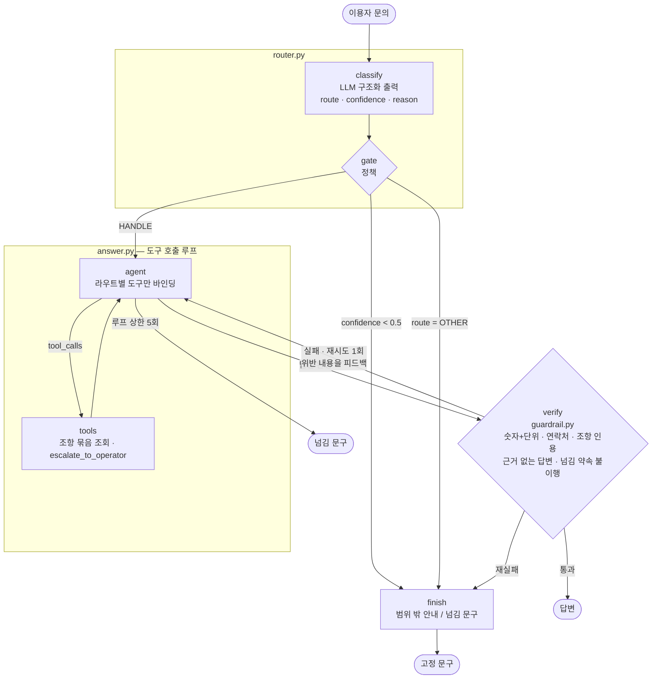
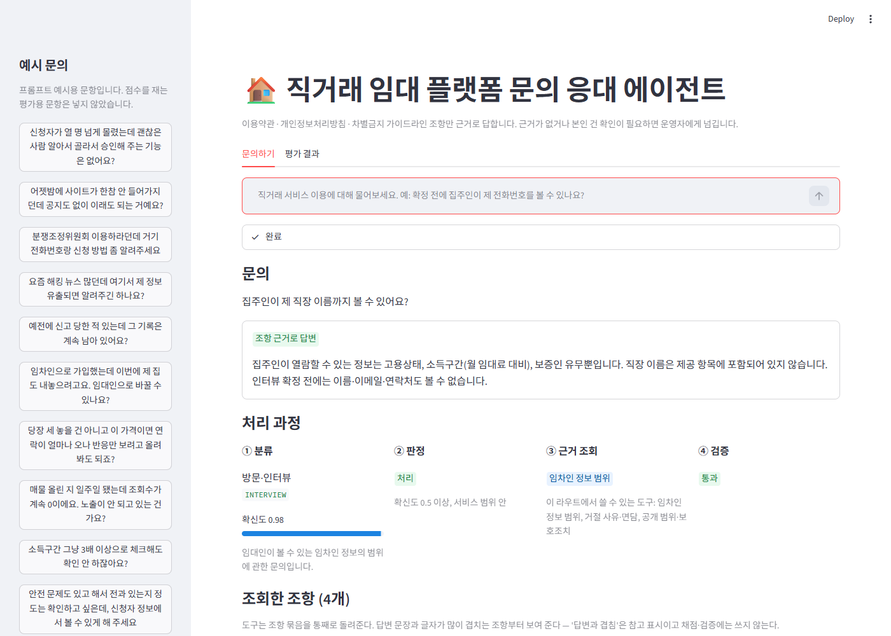
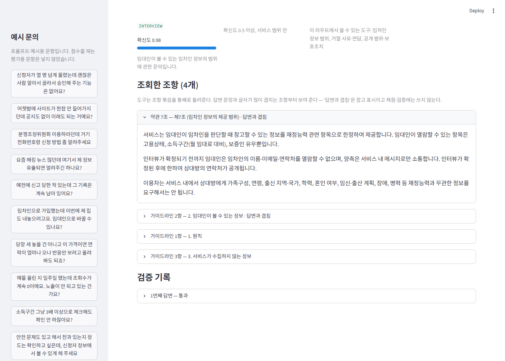
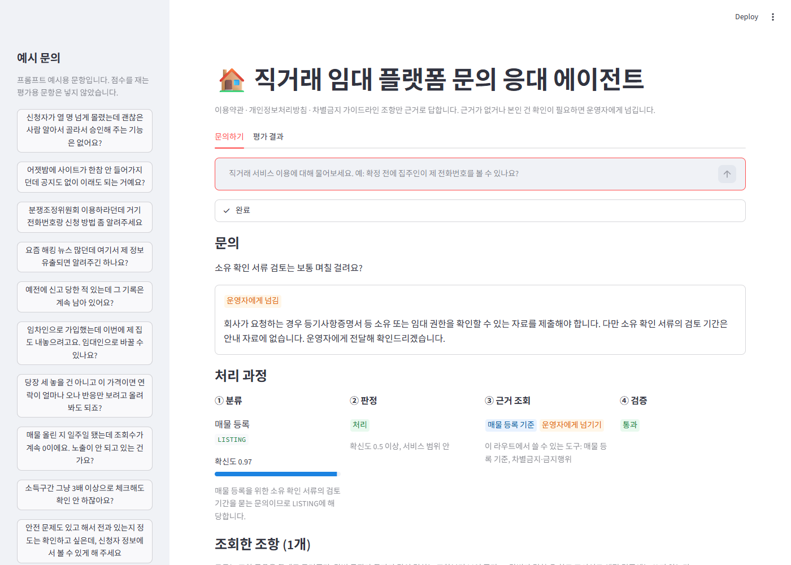
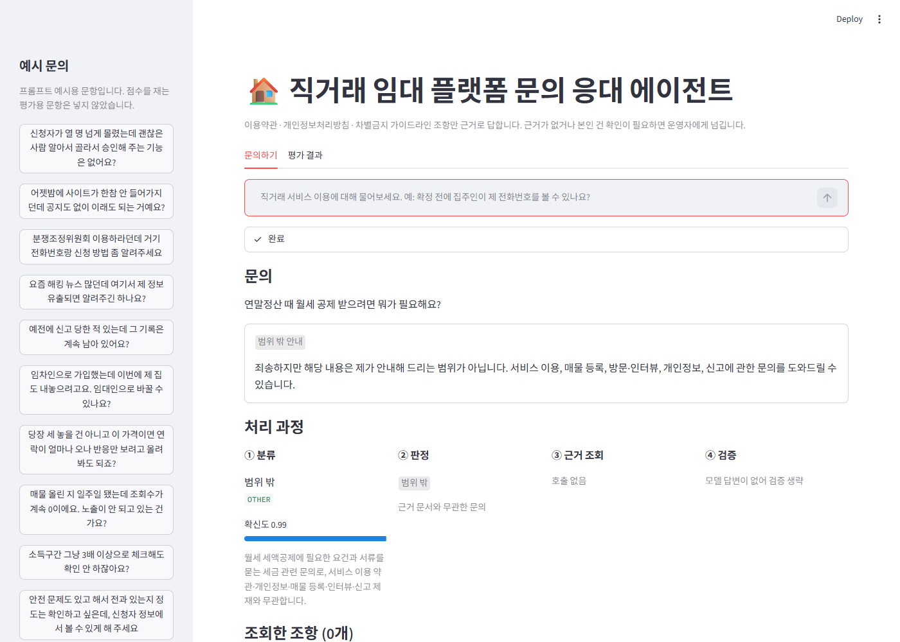
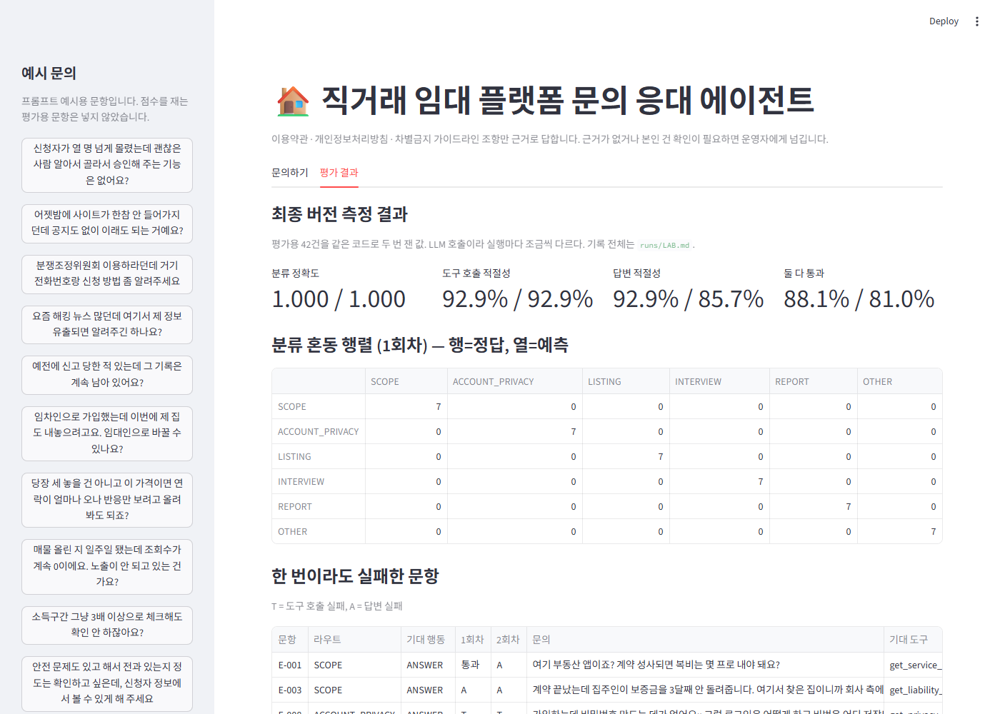

# REPORT — 직거래 임대 플랫폼 문의 응대 에이전트

모두의연구소 Agt1 "[실습 프로젝트] 라우팅 에이전트 만들기" 제출물.

## 요약

| 지표 (평가용 42건, 2회 측정) | 기준선 | 최종 |
|---|---|---|
| 분류 정확도 | 1.000 / 0.976 | **1.000 / 1.000** |
| 분류 macro F1 | 1.000 / 0.976 | **1.000 / 1.000** |
| 도구 호출 적절성 | 83.3% / 85.7% | **92.9% / 92.9%** |
| 답변 적절성 | 76.2% / 76.2% | **92.9% / 85.7%** |
| 도구·답변 둘 다 통과 | 71.4% / 76.2% | **88.1% / 81.0%** |
| 넘기기 문항 9건 중 둘 다 통과 | 5 / 7 | **9 / 8** |

- 같은 코드를 두 번 잰 값을 "1회차 / 2회차"로 적었다. LLM 호출이라 42건에서 한 번에 최대 14%p까지 흔들렸다
- 채점기 검증: 모범 답안 56/57 통과, 사실 뺀 답안 38/38 잡음, 금지 내용 넣은 답안 57/57 잡음
- 실험 8회 (유지 5, 되돌림 2, 적용 전 기각 1). 전체 기록 [runs/LAB.md](runs/LAB.md)

---

## 1. 주제와 근거 문서

### 무엇을 골랐나

- 주제: 중개 없는 부동산 직거래 임대 플랫폼(서울 관악·마포 파일럿)의 이용자 문의 응대
  - 직접 개발 중인 서비스. 서비스 저장소는 비공개라 이 저장소를 따로 만듦
- 근거 문서: 서비스에 실제 게시하는 법적 고지 3종

| 문서 | 섹션 | 본문 글자 수 | 파일 |
|---|---|---|---|
| 이용약관 | 13조 + 부칙 | 약 9.8k | [docs/terms.md](docs/terms.md) |
| 개인정보처리방침 | 12항 | 약 8.1k | [docs/privacy.md](docs/privacy.md) |
| 차별금지 가이드라인 | 8항 | 약 4.6k | [docs/non-discrimination.md](docs/non-discrimination.md) |

### 왜 골랐나

- 과제 조건 세 가지를 모두 만족
  - 카테고리마다 답하는 내용이 다름: 중개 여부 / 개인정보 보유기간 / 등록 기준 / 임차인 정보 공개 범위 / 신고 절차
  - 조항 단위로 이미 나뉘어 있어 카테고리별로 나눠 넣을 만큼 김
  - 문서를 안 읽으면 그럴듯하게 틀리는 질문이 많음
    - "중개수수료 얼마?" → 상식은 "0.4%", 약관 3조는 "중개 아님, 보수 없음"
    - "보증금 못 받으면 보상?" → 상식은 "보증보험", 약관 12조는 "계약 당사자 아님"
    - "소유 확인 며칠?" → 상식은 "1~2영업일", 문서엔 기간이 없음
- 결과를 서비스 운영(문의 응대 초안)에 그대로 쓸 수 있음

### 문서 준비

- 원본은 서비스 저장소의 구조화 데이터(`src/lib/legal/*.ts`)
- [scripts/export_docs.mjs](scripts/export_docs.mjs)로 마크다운 추출. 파일 상단에 원본 커밋 기록
- 추출하며 발견해 서비스 쪽을 고친 것
  - 처리방침 5항에 내부 메모 `TODO(오픈 전): Vercel 리전 확인…`이 공개 화면에 렌더되고 있었음 → 코드 주석으로 옮김
  - 그대로 뒀으면 에이전트가 "국외이전 동의를 받아야 합니다"라고 답할 근거가 됨
- 고치지 않기로 한 것
  - 소유 확인 배지, 신고 3건 자동 비공개는 구현돼 있지만 약관에 없음
  - 과제용 안내 문서를 새로 쓰면 "내가 쓴 문서로 내가 평가"하는 구조가 됨 → 게시 문서만 근거로 쓰고, 이 공백은 넘기기 문항으로 활용

---

## 2. 카테고리 설계

### 카테고리와 나눈 근거

- 기준: 문의가 이용자 여정의 어느 단계에서 나오는가 = 운영자가 볼 문서 부분이 다름

| 라우트 | 이름 | 대표 문의 |
|---|---|---|
| `SCOPE` | 서비스 성격·거래 책임 | 중개수수료, 계약서 대행, 보증금 사고, 분쟁, 지역·요금 |
| `ACCOUNT_PRIVACY` | 계정·개인정보 | 가입 조건, 탈퇴, 수집 항목, 보유기간, 열람·삭제, 유출 |
| `LISTING` | 매물 등록 | 등록 기준, 서류, 대리 등록, 조건 기재, 중복 등록 |
| `INTERVIEW` | 방문·인터뷰 | 임대인이 보는 정보, 연락처 공개 시점, 물어봐도 되는 것, 거절 사유 |
| `REPORT` | 신고·제재 | 차별 신고, 허위매물·송금 요구, 제재, 이의 제기 |
| `OTHER` | 범위 밖 | 시세, 대출 금리, 이사, 세금, 정부 지원 |

- 초안(4개 + 범위 밖)에서 바뀐 점
  - 중개수수료·보증금 사고를 처음엔 범위 밖에 넣었음
  - 그런데 약관 3·12·13조가 직접 답함 → 근거가 있는 문의를 범위 밖에 두면 "범위 밖 = 근거 없음" 구분이 깨짐 → `SCOPE`로 분리
- 경계 규칙 (분류 지침에 명시)
  - 차별 **기준**을 묻는다 → `INTERVIEW` / 차별을 **당했다** → `REPORT`
  - 등록 **기준** → `LISTING` / 허위매물을 **봤다** → `REPORT`
  - 연락처 **공개 시점** → `INTERVIEW` / 내 정보 **삭제 요구** → `ACCOUNT_PRIVACY`
- 넘기기(`ESCALATE`)는 카테고리가 아니라 별도 판단
  - `classify`(모델이 라우트 선택)와 `gate`(확신도 0.5 미만이면 넘김)를 노드로 분리
  - 문서 공백·개별 건 확인으로 인한 넘김은 답변 단계에서 조항을 읽은 뒤 결정

### 매핑표 — 카테고리 → 도구 → 조항

- 도구 = 조항 묶음 조회. 문서 3개 단위가 아니라 10개로 쪼갬
  - 문서 단위면 처리방침 하나만 불러도 12항이 다 들어와 "관련 없는 근거를 훑었는지"를 못 잼

| 도구 | 반환 조항 |
|---|---|
| `get_service_scope` | 약관 1·2·3·11조 |
| `get_liability_disputes` | 약관 12·13조, 가이드라인 7항 |
| `get_account_rules` | 약관 4·5조, 처리방침 7항 |
| `get_data_handling` | 처리방침 1·2·3·6항 |
| `get_privacy_safeguards` | 처리방침 4·5·8·9·10·11·12항 |
| `get_listing_rules` | 약관 6조 |
| `get_tenant_info_scope` | 약관 7조, 가이드라인 1·2·3항 |
| `get_rejection_and_conduct` | 가이드라인 4·5항 |
| `get_prohibited_acts` | 약관 8·9조 |
| `get_report_process` | 약관 10조, 가이드라인 6항 |
| `escalate_to_operator` | 조회 없음. 운영자에게 넘김 |

| 라우트 | 붙이는 도구 |
|---|---|
| `SCOPE` | 서비스 성격, 책임·분쟁, 매물 등록 기준(임대차 신고 의무 주석) |
| `ACCOUNT_PRIVACY` | 계정 규칙, 수집·보유·파기, 공개 범위·보호조치 |
| `LISTING` | 매물 등록 기준, 차별금지·금지행위 |
| `INTERVIEW` | 임차인 정보 범위, 거절 사유·면담, 공개 범위·보호조치 |
| `REPORT` | 신고 절차, 차별금지·금지행위, 책임·분쟁 |
| `OTHER` | 없음 |

- 모든 라우트에 `escalate_to_operator` 추가
- 섹션 34개 중 32개 배정. 남은 2개(부칙, 가이드라인 8항)는 사업자정보·연락처 빈칸뿐
- **구현으로 보장**: 답변 모델에는 그 라우트의 도구만 바인딩 → 다른 카테고리 조항은 호출 자체가 불가
- 라우트끼리 도구가 일부 겹침(예: `REPORT`도 책임·분쟁 도구 보유)
  - 경계 문항이 오분류돼도 같은 조항을 읽을 수 있음. 실제로 E-004가 `SCOPE`→`REPORT`로 틀렸을 때도 도구·답변 모두 통과
- 표는 [context.py](context.py) 한 곳에만 둠. 평가셋 검사기도 같은 표를 import. 상세 [docs/MAPPING.md](docs/MAPPING.md)

---

## 3. 평가셋 설계

### 규모와 파일

| 파일 | split | 건수 | 작성자 | 용도 |
|---|---|---|---|---|
| [data/goldenset_eval.json](data/goldenset_eval.json) | `eval` | 42 | 별도 에이전트 | 점수 측정만 |
| [data/goldenset_fewshot.json](data/goldenset_fewshot.json) | `fewshot` | 15 | 메인 세션 | 프롬프트 예시만 |
| [data/judge_controls.json](data/judge_controls.json) | — | 95 | 생성 + 전수 검토 | 채점기 검증 |

| 평가용 분포 | ANSWER | ESCALATE | OUT_OF_SCOPE | 합 |
|---|---|---|---|---|
| SCOPE | 6 | 1 | 0 | 7 |
| ACCOUNT_PRIVACY | 5 | 2 | 0 | 7 |
| LISTING | 5 | 2 | 0 | 7 |
| INTERVIEW | 6 | 1 | 0 | 7 |
| REPORT | 4 | 3 | 0 | 7 |
| OTHER | 0 | 0 | 7 | 7 |
| 합 | 26 | 9 | 7 | 42 |

### 문항 구조

- 필드: `query` · `route` · `action` · `expected_tools` · `must`(사실 + 근거 조항) · `forbid`(그럴듯한 오답 + 이유) · `reference`(모범 답안)
- 명세 [data/SCHEMA.md](data/SCHEMA.md)

### 기대 도구를 정한 근거

- `must` 사실마다 조항 번호를 적고, 그 조항을 반환하는 도구 집합 = 기대 도구
- 넘기기 문항은 두 종류로 구분
  - **문서 공백** (주제는 있는데 물은 사실이 없음: 처리 기간, 몇 건, 연락처 빈칸) → 주제 도구 + 넘기기. 문서를 읽어야 없다는 걸 알 수 있음
  - **개별 건 확인** (내 신청·내 신고 상태) → 넘기기만
- [scripts/check_goldenset.py](scripts/check_goldenset.py)가 기계적으로 확인
  - `must` 조항 → 필요한 도구를 계산해 `expected_tools`와 정확히 일치하는지
  - 일부러 틀린 문항 5종(도구 과잉·누락, 넘기기 누락, 없는 조항, 라우트 오류)을 넣어 검사기 자체도 확인

### 필수 사실·금지 표현을 정한 근거

- `must`: 조항에서 문의에 답하는 사실을 표현이 아닌 사실 단위로
- `forbid`: 문서를 안 읽고 일반 상식으로 답할 때 나올 오답
  - 지어낸 수치·기간·연락처 ("1~2영업일", "privacy@…")
  - 문서와 반대되는 단정 ("중개 수수료 0.4%", "보증보험으로 보호")
  - 범위 밖 문항은 실제로 답해 버리는 것 ("청년 월세 지원 소득 기준은 중위소득 60%")

### 평가용과 예시용을 가른 방법

- **작성자 분리**: 평가용은 프롬프트·예시를 못 본 별도 에이전트가 명세와 문서 3개만 보고 작성
  - 이 프로젝트 이전 작업(차별 질문 감지기)에서 작성자가 같은 셋은 만점 근처, 블라인드 셋은 재현율 0.64였던 경험
- **누출 발견과 교체**
  - 예시용 v1.0이 평가용과 `must` 사실 20건을 공유 (15건 중 14건이 사실상 같은 질문)
  - 서로 못 본 두 작성자가 문서에서 가장 눈에 띄는 사실(중개수수료, 만 19세, 가계약금)로 수렴한 것
  - 질문 문장 유사도로는 안 잡힘 (거의 같은 질문 F-001/E-001이 0.07)
  - 같은 조항 + 사실 문장 유사도 0.5 이상을 누출로 판정하는 검사 추가 → 예시용 전부 교체 → 0건
- **코드로 강제**: `prompts.py`가 예시 파일에 `fewshot`이 아닌 문항이 섞이면 import 시 실패

---

## 4. 측정 결과

### 측정 방법

- [evaluate.py](evaluate.py)
  - 분류: 정확도 · macro F1 · 혼동 행렬 · 오분류 목록
  - 도구 호출 적절성: 호출한 도구 집합 == 기대 도구 집합이면 1점
  - 답변 적절성: `must` 전부 포함 + `forbid` 위반 0이면 1점
- 답변 채점기 [judge.py](judge.py)
  - LLM이 `must`·`forbid` 항목마다 판정하고 답변 속 근거 문장을 적음
  - 지침에 "표현이 아니라 사실을 본다", "부정 맥락 언급은 위반 아님" 명시
  - 항목을 빠뜨리면 통과로 치지 않음

### 채점기 검증

| 검사 | 기대대로 판정 |
|---|---|
| 모범 답안 57건 → 통과 | 56 (98.2%) |
| `must` 사실 하나 뺀 답안 38건 → **그 사실** 누락 판정 | 38 (100%) |
| `forbid` 내용 넣은 답안 57건 → **그 항목** 위반 판정 | 57 (100%) |

- 오답 변형은 "노린 항목"을 잡았는지까지 확인. 다른 이유로 실패하면 우연히 맞은 것으로 봄
- 어긋난 1건(E-023): 모범 답안이 "이메일"을 빠뜨림. 채점기가 아니라 정답 쪽 누락
- 오답 변형을 만들며 걸린 함정
  - 모델에게 "금지 내용을 넣어 답안을 다시 써라" → 거짓 단정을 피해 원문을 그대로 두거나 "확인이 필요합니다"로 얼버무림
  - 그대로 썼으면 채점기가 맞게 판정한 것을 놓침으로 세고, 멀쩡한 채점기를 고쳤을 것
  - 오답 문장 하나만 생성 → 삽입은 코드가 → 57건 전수 확인, 4건 손으로 수정

### 검증 단계(파이프라인 ④) 자체의 시험

- [guardrail.py](guardrail.py): 답변의 숫자(단위 포함)·연락처·조항 인용이 조회한 조항 원문에 있는지 대조
- [scripts/test_guardrail.py](scripts/test_guardrail.py) 22개 케이스 통과, 모범 답안 48건 오탐 0
- 규칙을 바꿀 때마다 저장된 답변 전체에 다시 돌려 영향 범위를 먼저 확인

### 개선 시도별 기록

| # | 바꾼 것 | 분류 | 도구 | 답변 | 둘 다 | 판정 |
|---|---|---|---|---|---|---|
| 1 | 기준선 | 1.000 / 0.976 | 83.3 / 85.7 | 76.2 / 76.2 | 71.4 / 76.2 | — |
| 2 | 검증: "운영자에게 전달"이라 쓰고 넘기기 안 부르면 실패 | 0.976 / 1.000 | 83.3 / 85.7 | 76.2 / 76.2 | 73.8 / 73.8 | 유지 |
| — | 검증: "안내 자료에 없다" 인정 후 안 넘기면 실패 | — | — | — | — | 적용 전 기각 |
| 3 | 답변 절차: 넘기기 전에 조항 먼저 조회 | 1.000 / 1.000 | 88.1 / 90.5 | 73.8 / 88.1 | 71.4 / 81.0 | 유지 |
| 4 | 검증기 오탐: 원문 "둘 이상" ↔ 답변 "두 건" 허용 | — | — | — | — | 유지 (재생으로 확인) |
| 5 | 도구 설명: 겹치는 계정 주제의 상세 위치 안내 | 0.976 / 1.000 | 95.2 / 95.2 | 88.1 / 81.0 | 85.7 / 78.6 | 유지 |
| 6 | 도구 설명: 5조를 깎아내리던 표현 수정 | 1.000 / 1.000 | 92.9 / 92.9 | 92.9 / 85.7 | 88.1 / 81.0 | **최종** |
| 7 | 도구 설명에서 사실 단정 제거 | 1.000 / 0.976 | 88.1 / 88.1 | 76.2 / 78.6 | 71.4 / 73.8 | 되돌림 |
| 8 | 여러 질문 문의는 질문마다 근거 찾기 | 0.976 / 0.976 | 92.9 / 90.5 | 83.3 / 81.0 | 76.2 / 73.8 | 되돌림 |

- 점수 단위 %. 한 번에 하나만 바꾸고 매번 2회 측정
- 합계보다 문항별 비교표([scripts/compare_runs.py](scripts/compare_runs.py))로 판정. 합계가 같아도 고친 문항과 깨진 문항이 섞여 있었음

### 틀린 건의 원인 분류

**기준선 (2회 중 두 번 다 실패 9건)**

| 원인 | 문항 | 구체적으로 |
|---|---|---|
| 엉뚱한 조항 묶음 | E-008, E-010 | 비밀번호 저장 문의에 약관 5조만 읽고 "문서에 없다". 답은 처리방침 8항 |
| 조회 없이 넘김 | E-007, E-014, E-026 | 프롬프트의 "공백이면 조회 먼저"와 "개별 건은 바로 넘김"이 충돌 |
| 두 번째 근거 누락 | E-032 | 차별 구제 문의에 인권위만 안내, 신고 절차 도구 안 부름 |
| 목록 일부만 답함 | E-015, E-017, E-027 | 조항 목록·조건 중 질문에 해당하는 것만 답함 |
| 넘긴다 말하고 안 넘김 | E-035 (1회) | "운영자에게 전달하겠다"고 썼는데 도구 미호출 → 실제로는 안 넘어감 |

**최종 (2회 측정 기준 남은 실패)**

| 문항 | 결과 | 원인 | 성격 |
|---|---|---|---|
| E-003 | 2/2 답변 실패 | "이행·**해지** 및 분쟁"의 "해지" 누락 | 채점 기준 엄격 |
| E-027 | 2/2 답변 실패 | 베트남 국적 문의에 "국적"만 답하고 출신 지역·민족 생략 | 채점 기준 엄격 |
| E-032 | 2/2 둘 다 실패 | 신고 절차 도구 미호출, 인권위 구제 한계 누락 | 에이전트 |
| E-026 | 2/2 도구 실패 | '기타' 뜻을 정확히 답한 뒤 불필요하게 넘기기까지 함 | 에이전트 |
| E-008 | 2/2 도구 실패 | 도구를 하나 더 부르거나, 조항 대신 도구 설명 문구를 근거처럼 씀 | 애매 문항 + 설명 누출 |
| E-001, E-017, E-034 | 1/2 답변 실패 | 사실 하나씩 흔들림 | 실행 편차 |

- "채점 기준 엄격" 결정
  - 평가용은 블라인드라 `must`를 고치지 않음
  - 기준에 맞추려 답을 늘리지도 않음. 점수는 오르지만 응대 품질이 좋아진 게 아니라서
  - E-015(대리 등록)는 같은 유형이지만 "적법한 권한이 있으면 가능"이라는 핵심 조건이 빠져 진짜 실패로 분류

---

## 5. 파이프라인 구조도

### State (`agent.py`의 `AgentState`)

| 키 | 채우는 노드 | 내용 |
|---|---|---|
| `question` | 입력 | 이용자 문의 |
| `route` · `confidence` · `reason` | classify | 라우트, 확신도, 판단 근거 |
| `decision` | gate | `HANDLE` / `ESCALATE` / `OUT_OF_SCOPE` |
| `tools` · `sections` · `answer` | answer | 호출한 도구, 조회한 조항 원문, 답변 |
| `action` | answer · finish | 최종 행동 `ANSWER` / `ESCALATE` / `OUT_OF_SCOPE` |
| `verify` · `history` · `attempts` | verify · answer | 마지막 검증, 시도별 (답변·도구·검증), 생성 횟수 |
| `loop_limit` | answer | 도구 루프 상한에 걸림 |

### 설계 선택

- **classify와 gate 분리**: 임계값만 바꿀 때 모델을 다시 안 부름. "카테고리 고르기"와 "넘길지 판단"을 따로 잼
- **라우트별 도구 바인딩**: 카테고리별 근거 조립을 프롬프트 지시가 아니라 구조로 보장
- **도구는 인자 없음**: 같은 도구는 언제나 같은 조항 반환 → 도구 호출 채점이 결정적
- **검증은 규칙 기반**: 매번 같은 결과라 저장된 답변에 다시 돌려 규칙 변경의 영향을 API 호출 없이 확인
  - 한계: 숫자·연락처·조항 번호가 없는 지어낸 사실은 못 잡음. 그건 채점기의 `forbid`가 잼
- 모델: 분류 `gpt-5.6-luna`, 답변·채점 `gpt-5.6-terra` (temperature 0)

---

## 6. 데모 설계

- 실행: `streamlit run app.py` ([app.py](app.py))
- 캡처 재현: [scripts/capture_demo.py](scripts/capture_demo.py) (설치된 Chrome + Playwright)

### 신경 쓴 부분

- **처리 과정을 과제 구조 그대로 네 칸으로**: ① 분류(라우트·확신도·이유) → ② 판정 → ③ 근거 조회 → ④ 검증
  - 틀린 답이 나오면 어느 단계에서 틀렸는지 화면에서 바로 보이게
- **이 라우트에서 쓸 수 있는 도구도 함께 표시**: 카테고리별로 근거가 제한된다는 걸 보여 줌
- **조회한 조항 원문을 그대로 펼쳐 봄**
  - 도구가 조항 묶음을 통째로 돌려줘서 "근거 7개"처럼 부풀어 보였음 → 제목을 "조회한 조항"으로 바꿈
  - 답변과 글자가 많이 겹치는 조항부터 정렬하고 "답변과 겹침" 표시. 참고용이며 채점에는 안 씀
- **검증 기록**: 첫 답변이 검증에 걸렸으면 그 답변과 걸린 이유(예: "출처 불명 숫자 3건")를 펼쳐 보여 줌
- **결과 배지 세 가지를 색으로 구분**: 조항 근거 답변(초록) / 운영자에게 넘김(주황) / 범위 밖 안내(회색)
- **예시 문의는 예시용 15건에서만**: 평가용 문항을 화면에 노출하면 누구든 눌러 보며 정답을 맞춰 가게 됨
- **평가 결과 탭**: 저장된 최종 측정 2회를 API 호출 없이 표시 (지표, 혼동 행렬, 실패 문항)

### 화면

조항 근거 답변 — 직장 이름은 임대인이 볼 수 없다 (약관 7조)

조회한 조항 원문과 검증 기록

문서 공백 → 운영자에게 넘김 — 소유 확인 서류 검토 기간은 약관에 없음

범위 밖 안내

평가 결과 탭

---

## 7. 프로젝트 회고

### 가장 공들인 부분

- **점수를 믿을 수 있게 만드는 일**
  - 평가셋 작성자 분리 → 그래도 예시용이 정답을 20건 새고 있었음 → 사실 단위 누출 검사로 발견
  - 채점기를 모범 답안뿐 아니라 "노린 항목을 잡는가"까지 검증 → 변형 생성 모델이 거짓 단정을 피한 함정 발견
  - 모든 실험 2회 측정 + 문항별 비교표 → 한 번만 쟀으면 실험 3을 "답변 -2.4%p"로 기각하고, 실험 8을 "E-032 도구 해결"로 유지했을 것
- **넘기기 경로를 정직하게**
  - "운영자에게 전달하겠다"고 말하고 실제로 안 넘기는 답변을 검증에서 막음
  - 문서 공백과 개별 건 확인을 평가셋에서 구분해 넘기기 문항 9건이 두 회차 9/9, 8/9 통과

### 배운 것

- 점수를 올린 변경은 규칙 추가보다 **충돌하는 규칙 정리**(실험 3)와 **도구 설명의 위치 안내**(실험 5·6)였음
- 문항 하나를 보고 만든 규칙은 그 문항보다 나머지 문항에 먼저 영향을 줌 (실험 8)
- 도구 설명의 구체적 단어는 도구 선택을 돕는 동시에 **조회하지 않은 근거로 샌다** (실험 6·7). 설명 문구만으로는 둘을 떼지 못함
- 결정적인 코드(검증기, 검사 규칙)는 저장된 결과에 재생해 보면 API 없이 효과를 미리 알 수 있음

### 향후 보완하고 싶은 것

- **의미 수준 검증**: 답변 문장마다 조회한 조항 중 어느 문장에 대응하는지 확인하는 단계. 도구 설명 누출(E-008)과 숫자 없는 지어낸 사실을 잡기 위해
- **평가셋 확대**: 42건은 1건이 2.4%p. 흔들림과 개선을 구분하려면 라우트당 15건 이상 필요
- **채점 기준 재검토**: E-003·E-027처럼 질문 맥락에 맞게 좁힌 답을 실패로 보는 `must`를 사람과 함께 다시 검토
- **문서 보강**: 소유 확인 절차, 신고 누적 기준, 권리 행사 연락처가 약관에 들어가면 넘기기 대신 답할 수 있음 — 서비스 백로그에 등록함
- **실제 문의로 새 블라인드 셋**: 파일럿 오픈 후 실제 이용자 문의(동의 범위 확인 후)로 교체
